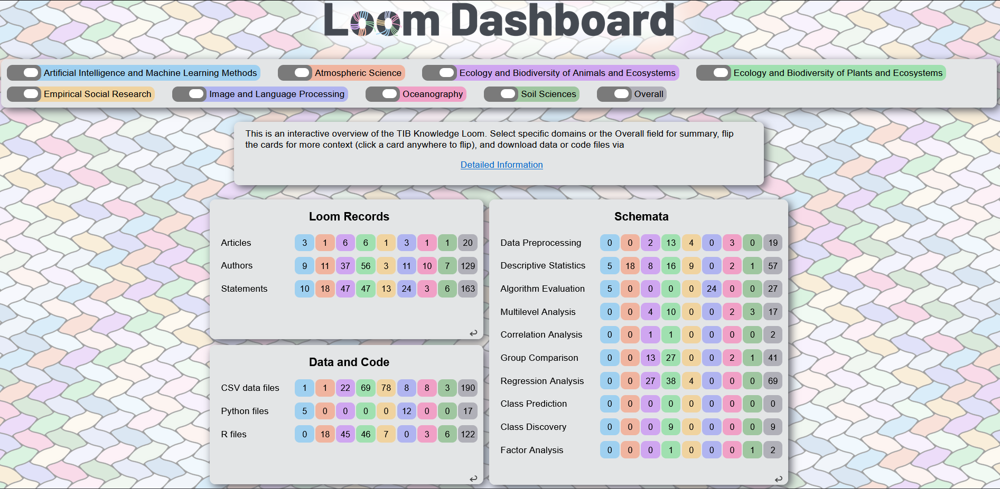

# Loom Dashboard
**100% AI-free: we did not use any AI technologies in developing this
dashboard.**



The dashboard is an interactive presentation of information provided by the 
[TIB Knowledge Loom](https://knowledgeloom.tib.eu/pages/about).
It runs on [Flask](https://flask.palletsprojects.com/en/stable/) and uses 
the [unpoly](https://unpoly.com/) framework for enhancing HTML.
We used the [Intertwined](https://github.com/nst/Intertwined ) library and the
[Barlow](https://www.1001fonts.com/barlow-font.html) font for aesthetics.
 

## Running locally
The project can be easily reproduced:
* Download the repository
* Install [Python UV](https://docs.astral.sh/uv/)
* Run the code locally:
```sh
uv run flask --app loom run -p 8000
```
When starting the dashboard for the first time, please consider that refreshing the cache takes longer 
than in subsequent runs. 

## Known limitations 
The dashboard is taking the related data from [Leibnitz Data Manager (LDM)](https://service.tib.eu/ldmservice/about). 
If another repository is used, or the structure of the LDM folders changes, 
the [get_data](get_data.py) file has to be changed accordingly.  
  
## Acknowledgements 
Many thanks to [Mikhail Lezhnin](https://github.com/mike239x/) and Valeriya Patueva for constructive criticism 
and useful suggestions.  
